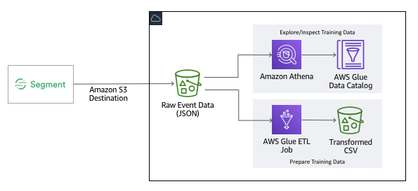
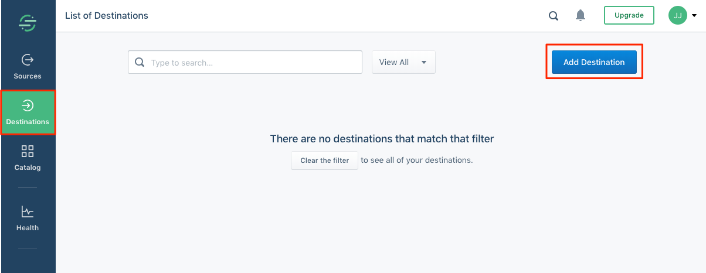
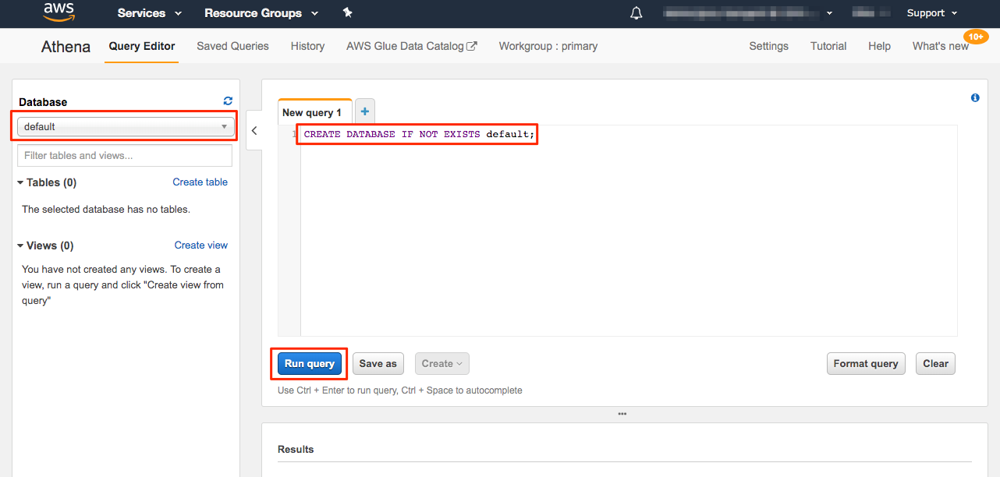
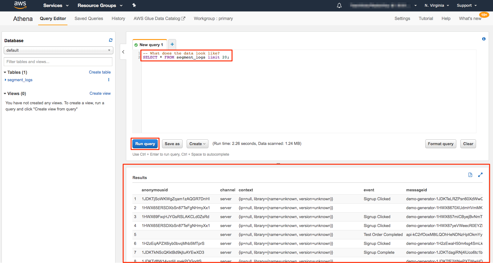
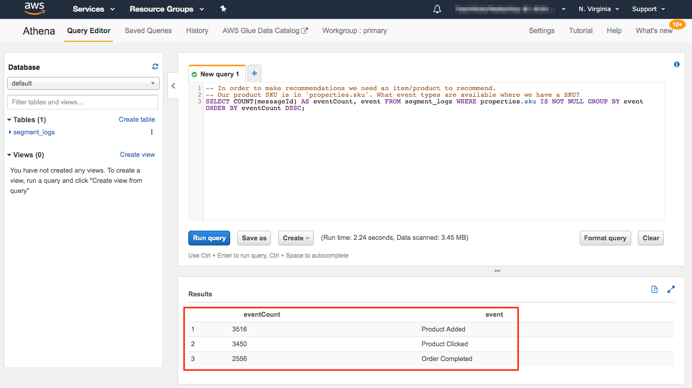
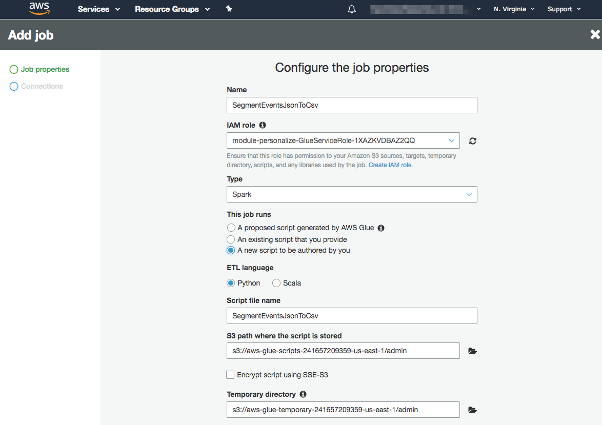
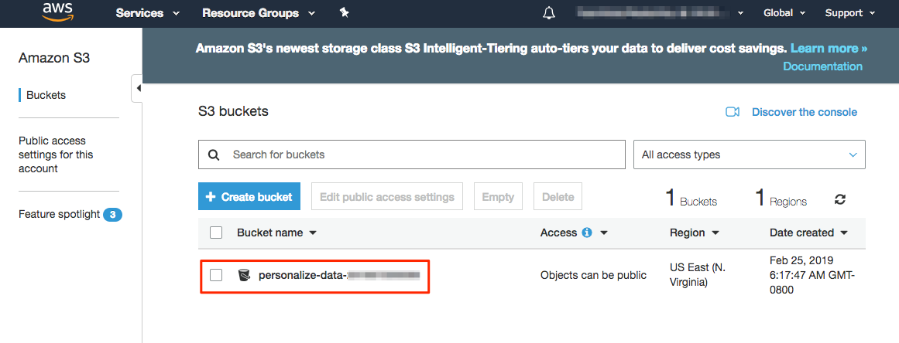
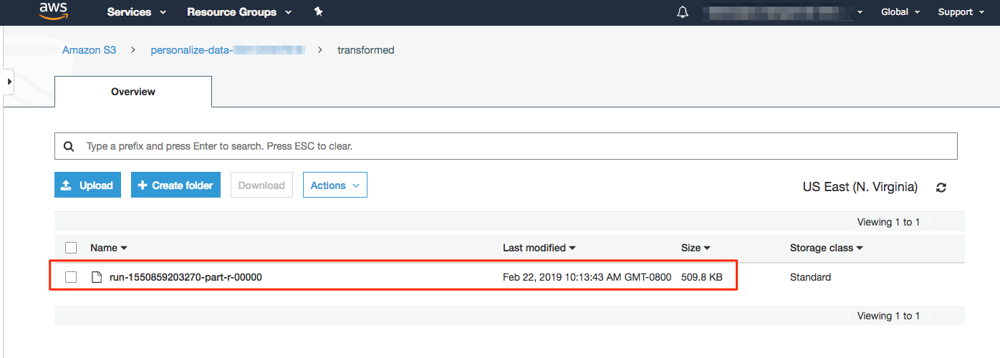

# Exercise 1 - Data Transformation, Filtering, and Exploration

## Overview

The effectiveness of machine learning models is directly tied to the quantity and quality of data input during the training process. For most personalization ML solutions, training data typically comes from clickstream data collected from websites, mobile applications, and other online & offline channels where end-users are interacting with items for which we wish to make recommendations. Examples of clickstream events include viewing items, adding items to a list or cart, and purchasing items. Although an Amazon Personalize Campaign can be started with just new clickstream data, the initial quality of the recommendations will not be as high as a model that has been trained on recent historical data.

One of Segment's core capabilities is the ability collect semantic events and properties and to aggregate those properties into user profiles using Personas for later use in marketing and analytics tools.

In this exercise we will walk through the process required to take historical clickstream data collected by Segment to train a model in Amazon Personalize. The advantage of bootstrapping Personalize with historical clickstream data is that you will start with a model that reflects your users's latest purchases and browsing behavior.

Segment provides the ability to send event data from one or more data sources configured in your Segment account to several AWS services including Amazon Simple Storage Service (S3), Amazon Kinesis, and Amazon Redshift. Since the raw format, fields, and event types in the Segment event data cannot be directly uploaded to Amazon Personalize for model training, this exercise will guide you through the process of transforming the data into the format expected by Personalize.

In the interest of time for the workshop, we will start with data that has already been written to an Amazon S3 bucket by the Segment S3 destination. The [format](https://segment.com/docs/destinations/amazon-s3/#data-format) of these files is compressed JSON where events are grouped into directories by Segment source ID and time. Since the Personalize service requires training data to be uploaded in CSV format, we will need to aggregate, filter, and transform the raw JSON into a single CSV file using an ETL job. We will use AWS Glue for this step. However, before creating our Glue ETL job, we'll learn how to use Amazon Athena to easily explore our training data. Being able to quickly inspect and investigate training data can be invaluable in gaining insight from and resolving data related issues.

> There is a minimum amount of data that is necessary to train a model in Personalize. Using existing historical data allows you to immediately start training a solution. If you ingest data as it is created, and there is no historical data, it can take a while before training can begin.

### What You'll Be Building



In this exercise we will walk through the process required to take the raw historical clickstream data collected by Segment to train a model in Amazon Personalize. The advantage of bootstrapping Personalize with historical clickstream data is that you will start with a model that has the benefit of past events to make more accurate recommendations. Segment provides the ability to push clickstream data to the following locations in your AWS account.

* S3 bucket
* Kinesis Data Stream
* Kinesis Data Firehose
* Redshift

For this exercise we will walk you through how to setup an S3 destination in your Segment account. In the interest of time, though, we will provide access to pre-populated in an existing S3 bucket. Then you will learn how to use Amazon Athena to query and visualize the JSON files directly from S3. Finally, you will use AWS Glue to create an ETL (extract, transform, load) Job that will filter and transform the raw JSON files into the format required by Personalize. The output file will be written back to S3 in your account. 

> The Segment Amazon S3 destination is just one method for collecting historical training data for Personalize. If you're already using [Segment's Amazon Redshift Data Warehouse destination](https://segment.com/docs/destinations/redshift/), you can easily extract (or unload) data from your Redshift instance to a CSV file in S3 that is suitable for uploading into Personalize. See the [sql/redshift_unload_as_csv.sql](sql/redshift_unload_as_csv.sql) file for a sample SQL statement.

### Exercise Preparation

If you have not already cloned this repository to your local machine, do so now.

    git clone https://github.com/james-jory/segment-personalize-workshop.git

### Claim your Segment Workspace

For the live workshop exercises, Segment has pre-provisioned workspaces for the workshop.  If you are doing this workshop after the live event, you will need a new Business Tier workspace with Personas enabled from Segment, or you will need to use your existing Segment workspace. If you do not have one, please contact your Segment sales representative at https://segment.com/contact/sales/.

To get your workshop workspace:

1. Open the Google Sheet at [Segment Workspaces](https://docs.google.com/spreadsheets/d/1SyEDxLmquN96tsv-dhrOhduRLilWjITQyCBXCcA73U4/edit?usp=sharing)
2. Find an unclaimed workspace


3. Claim your shiny new Segment workspace by putting your name in the appropriate fields, please.

## Part 1 - Set up Your Segment Workspace

After you have claimed your workspace, there are a couple of steps you need to follow to get it ready to start the workshop.


1. Go to [https://app.segment.com](https://app.segment.com/).
2. Make sure you select the “Password” login radio button.
3. Log in as:

```
username: igor+awsmlworkshop@segment.com
password: <will be on the whiteboard>
```


4. Click the “Log In” button.
5. Find the workspace name you claimed in the spreadsheet.
6. Click the tile with the name you claimed.


7. Click on the Settings gear in the bottom left corner of the screen that appears.


8. Change the name of the workspace to something you will remember, so that you can find your workspace more easily in case you have to log back in during or after the workshop.
9. Add `igor+awsmlworkshop@segment.com` in the Incident Contact section.
10. Click the “Save Changes” button.


## Part 2 - Create Segment Sources

Segment Sources allow you to collect semantic events as your users interact with your web sites, mobile applications, or server-side applications.  For this workshop, you will set up sources for a web application, an Android application, and iOS mobile application.  We will also create a source that will be used to send recommendations from Personalize to user profiles in Segment.

Your initial Segment workspace will look like this:


You will need to add four sources, using the ‘Add Source’ button in the screen shot above.  To set up a source:


Once your source is configured, it will appear in your workspace like this:


You will need to repeat these steps to configure three more sources.  One for Android, one for iOS, and one for your Personalize events.  

Name your sources as follows:

```
website-prod
android-prod
ios-prod
personas-events-source
```

For the web source, use the Javascript source type, for Android the Android source, for iOS the iOS source, and for the personas-events-source use the Python source type.

## Part 3 - Set up Segment Personas

Personas will use the events that you collect from your user interactions to create individual user profiles.  This will allow you and your marketing teams to group users into audiences.  Later, you will be able to define the destinations to which you will be able to send user definitions and traits by setting up destinations in Personas.  You will also be able to add product recommendations from Personalize to each user profile in Personas.

After setting up your sources, your workspace should look something like this:


Click on the Personas Orb on the left hand side of your screen, and you will be redirected to the Personas setup wizard.  This will allow you to set up Personas so that it can receive events from the sources which you just configured.


Click ‘Get Started’ and enable all of the sources you just created:


Then click ‘Review’:


And then ‘Enable Personas.’

You now have an event channel from your applications, and a way to collect identity information about individual users.  Let’s set up Segment so that this data can be passed on to Personalize via an S3 bucket for your initial training set.


## Part 4 - Create S3 Destination in Segment

Although we won't be testing pushing data from Segment to S3 in the workshop due to time limitations, we will walk through how to configure an S3 destination in Segment. Start by logging in to your Segment account and clicking "Destinations" in the left navigation. Then click the "Add Destination" button.



On the Destination catalog page, search for "S3" in the search field. Click on "Amazon S3" in the search results.


Click "Configure Amazon S3" to setup the S3 destination.


On the "Select Source" page, select an existing Source and click the "Confirm Source" button. To learn more about setting up Sources in Segment, see the Segment [documentation](https://segment.com/docs/sources/).


The Settings page for the S3 Destination requires an S3 bucket name. An S3 bucket has already been created for you in your AWS account for the workshop. To find the bucket name, login to your AWS workshop account and browse to the S3 service page in a different browser tab/window. Locate the bucket with a name starting with `personalize-data-...`. Click on the bucket name and copy the name to your clipboard.


Back on the Segment Amazon S3 destination settings page, paste the bucket name into the "Bucket Name" field. Also be sure to activate the destination at the top of the configuration form.


Detailed instructions for configuring an S3 destination can be found on Segment's [documentation site](https://segment.com/docs/destinations/amazon-s3/).

As mentioned above, we won't be testing actually pushing data through the S3 destination in this workshop due to time limitations. Instead, we will use raw data already collected in an S3 bucket.

## Part 5 - Send Test Data Into Your Segment Workspace

In this step you will pre-populate simulated event data into your Segment instance, your S3 bucket, and Personas.

The data you pre-populate here will be *required* in later steps when configuring Personalize to send recommendations to Personas and your marketing tools.

Because events are synchronized from Segment to S3 on a batch basis, we will also give you a pre-populated initial training set to save time, in the next part.

You will need some data to be populated in Segment however, since this will allow you to create recommendations based on (simulated) user activity later on.

This part can be choose your own adventure, though we strongly recommend using the AWS Cloud9 option to avoid Python package hell. Let’s start with Cloud9.

> AWS Cloud9 is a cloud-based integrated development environment (IDE) that lets you write, run, and debug code with just a browser. The purpose of using Cloud9 for this part of the workshop is to simply provide a consistent and predictable environment for running a Python script that will push sample data into your Segment workspace. Cloud9 is not required to use Segment or Personalize.

1. Go to your AWS Console.
2. Under the Services dropdown, find Cloud9
3. Click the “Create Environment” button.


4. Give your environment a name.
5. Click the “Next Step” button.


Cloud9 terminals run in VPCs like all EC2 instances.


6. Change the Platform radio button to “Ubuntu Server”.  This is essential for the Python environment steps below to work properly.
7. Change the Cost-saving setting to “After four hours”.   This sets a longer timeout for the inactivity monitor.
8. Click the “Create new VPC” button.  This will open a new tab or browser window, depending on your browser.


8. Select the default, VPC with a single public subnet.
9. Click the Select button.


10. Name your subnet.
11. Click the Create VPC button.


12. Go back to the Cloud9 configuration wizard in the previous screen or tab.
13. Your VPC and subnet should already be automatically selected.  If they are not, click the refresh button next to the VPC dropdown.
14. Select your VPC.
15. Click the Next Step button.


16. Click the “Create Environment” button.


17. You will be forwarded to a screen that shows your remote IDE which provides a terminal in which you can execute terminal commands.  If you are running an ad blocker in your browser, you will need to disable it for this URL because some ad blockers prevent the Cloud9 service from running in the browser.


18. Welcome, l33t h4x0r!


Keep this window or tab open, or at least save the URL to your instance.  You will need to use this one more time later in the workshop to send events into Segment.  Or like hack a mainframe or something.


19. You will need to run the following commands in the terminal window (you are in Ubuntu, right?)

```
git clone https://github.com/james-jory/segment-personalize-workshop.git
pip install python-dateutil --upgrade
pip install analytics-python
```

20. Open the segment-event-generator.py file in the ./data folder of the workshop project.

```
cd segment-personalize-workshop/data
vi segment-event-generator.py
```


21. Go to your Segment workspace window.
22. You will need the write keys for the web, android, and ios sources you created earlier. You can get these by clicking on each source as shown below.


The write key for the source is in the next screen:


23. Add each write key to the appropriate variable entry in the script (you will not need a key for the email_write_key):


24. Save your changes (escape key > colon key > `wq` in the vi terminal).   Now you can push events into your Segment sources.


25. In your Cloud9 terminal, run the script:

```
python segment-event-generator.py 2019-06-16
```

This will generate two days worth of interaction data in your Segment instance.  If you are using this after the date shown above, your should change the date to be at least one day prior to today so that you get a long enough run of historical data.


26. Validate you can see your events by clicking on each of your sources and looking at the Debugger tab.  You should see events in all of the sources you configured above.  Keep your Cloud9 terminal open for later.


## Part 6 - Explore Workshop Test Data

In the interest of time, we have pre-populated an S3 bucket with raw historical JSON data from a sample Segment account. We will use this data to train an initial model in Personalize that will be used throughout the remainder of this workshop.

In this step we will demonstrate how Amazon Athena can be used to create external table pointing at the raw JSON files and then query those files using SQL. This can be an invaluable tool to inspect your data before uploading it into Personalize and as you iterate with models over time.

Log in to the AWS console. If you are participating in an AWS led workshop, use the instructions provided to access your temporary workshop account. Browse to the Amazon Athena service page in the console, making sure that you are in the "N. Virginia" region. If this is the first time you've used Athena, you will be presented with a welcome page. Click the "Get started" button to continue. If the tutorial is presented, feel free to walk through the tutorial or click the "X" to exit the tutorial.

Before we can create a table for the data in S3, we need an Athena database. For the purposes of this exercise, the database that we use is not important. If a "default" or "sampledb" database already exists in your account, you can use that for the new table. Otherwise you can create a new database using the DDL statement below (paste it into the "New query 1" tab and press "Run query".

```sql
CREATE DATABASE IF NOT EXISTS default;
```



Next let's create a table in the Athena database above that points to the historical data in S3. We have written the DDL statement for you that will create this table. Open the [sql/athena_create_table.sql](sql/athena_create_table.sql) file, copy the contents to your clipboard, and paste file contents into the "New query 1" tab in the Athena console. Take a moment to inspect the `CREATE EXTERNAL TABLE...` statement. One important aspect of this DDL statement is that there are several field name mapping statements in the `SERDEPROPERTIES` section (as shown below). These mappings address the [Athena requirement](https://docs.aws.amazon.com/athena/latest/ug/tables-databases-columns-names.html) that the only special character allowed database, table, view, and column names is an underscore. Since the Segment test data has several trait names with embedded spaces, these mappings allow us to safely query this data in Athena.

```sql
CREATE EXTERNAL TABLE IF NOT EXISTS segment_logs (
    ...
  )           
ROW FORMAT SERDE 'org.openx.data.jsonserde.JsonSerDe'
WITH SERDEPROPERTIES (
  "mapping.campaign_name"="Campaign Name",
  "mapping.campaign_source"="Campaign Source",
  "mapping.experiment_group"="Experiment Group",
  "mapping.favorite_departments"="Favorite Departments",
  "mapping.invited_user"="Invited User?",
  "mapping.referrering_domain"="Referrering Domain"
  )
LOCATION 's3://segment-personalize-workshop/segment-logs/';
```

When you're ready, press the "Run query" button to execute the statement. This will create the table in the Glue Data Catalog. Now you are ready to execute queries against the compressed JSON files. Trying inspecting the data with a few queries.

```sql
-- What does the data look like?
SELECT * FROM segment_logs limit 20;
```



```sql
-- The 'event' column is what we can use for event type in training our model.
-- What event types are available?
SELECT COUNT(messageId) AS eventCount, event FROM segment_logs GROUP BY event ORDER BY eventCount DESC;
```


```sql
-- In order to make recommendations we need an item/product to recommend.
-- Our product SKU is in 'properties.sku'. What event types are available where we have a SKU?
SELECT COUNT(messageId) AS eventCount, event FROM segment_logs WHERE properties.sku IS NOT NULL GROUP BY event ORDER BY eventCount DESC;
```



From the results of the last query you will notice that there are three events that include a product SKU: 'Product Clicked', 'Product Added', and 'Order Completed'. We will use these events in training our model for product recommendations. We could also train models based on other event types, such as 'Page Viewed' or 'Signup Success' and use them to make content or membership program recommendations.

## Part 7 - Data Preparation

Since the raw format, fields, and event types in the Segment event data cannot be directly uploaded to Amazon Personalize for model training, this step will guide you through the process of transforming the data into the format expected by Personalize. We will use the same compressed JSON files you queried with Athena in the previous step. We will use AWS Glue to create an ETL job that will take the JSON files, apply filtering and field mapping to each JSON event, and write the output back to S3 as a CSV file.

### Create AWS Glue ETL Job

First, ensure that you are logged in to the AWS account provided to you for this workshop. Then browse to the Glue service in the console, making sure that the AWS region is "N. Virginia" (us-east-1). Click the "Get started" button and then click "Jobs" in the left navigation on the Glue console page.


Click the "Add job" button and enter the following information.

* Enter a job name such as "SegmentEventsJsonToCsv".
* For IAM role, a role has already been created for you that starts with the name `module-personalize-GlueServiceRole-...`. Select this role.
* Leave Type as "Spark".
* For "This job runs", click the radio button "A new script to be authored by you".
* Leave everything else the same and click Next at the bottom of the form.
* On the "Connections" step just click "Save job and edit script" since we are not accessing data in a database for this job.



The source code for the Glue job has already been written for you. Copy the contents of [etl/glue_etl.py](etl/glue_etl.py) to your clipboard and paste it into the Glue editor window. **Then click "Save" to save the job script.**


Let's review key parts of the script in more detail. First, the script is initialized with two job parameters. The `JOB_NAME` parameter is passed to our job by the Glue execution framework. Below we'll see how to specify the `S3_CSV_OUTPUT_PATH` parameter value when we run the job. This parameter tells our job where to write the CSV file.

```python
args = getResolvedOptions(sys.argv, ['JOB_NAME', 'S3_CSV_OUTPUT_PATH'])
```

Next the Spark and Glue contexts are created and associated. A Glue Job is also created and initialized.

```python
sc = SparkContext()
glueContext = GlueContext(sc)
spark = glueContext.spark_session
job = Job(glueContext)
job.init(args['JOB_NAME'], args)
```

The first step in our Job is to load the raw JSON file as a Glue DynamicFrame. We're loading the JSON from the shared S3 bucket (segment-personalize-workshop) where the training data for the workshop has already been staged. Note that we're specifying the `recurse:True` parameter so that Glue will recursively load all files under the `segment-logs` folder.

```python
datasource0 = glueContext.create_dynamic_frame_from_options("s3", {'paths': ["s3://segment-personalize-workshop/segment-logs"], 'recurse':True}, format="json")
```

Since we only want specific events for training our Personalize model, we'll use Glue's `Filter` transformation to keep only the records we want. The `datasource0` DynamicFrame created above is passed to `Filter.apply(...)` function along with the `filter_function` function. It's in `filter_function` where we keep events that have a userId, product SKU, and event specified. All other records are ignored. The resulting DynamicFrame is captured as `interactions`.

```python
supported_events = ['Product Added', 'Order Completed', 'Product Clicked']
def filter_function(dynamicRecord):
    if ('userId' in dynamicRecord and
            'properties' in dynamicRecord and
            'sku' in dynamicRecord["properties"] and
            'event' in dynamicRecord and
            dynamicRecord['event'] in supported_events):
        return True
    else:
        return False

interactions = Filter.apply(frame = datasource0, f = filter_function, transformation_ctx = "interactions")
```

Next we will call Glue's `ApplyMapping` transformation, passing the `interactions` DynamicFrame from above and field mapping specification that indicates the fields we want to retain and their new names. These mapped field names will become the column names in our output CSV. You'll notice that we're using the product SKU as the `ITEM_ID` and `event` as the `EVENT_TYPE` These will have meaning in the Personalize interaction schema that we will use when uploading the CSV into Personalize. We're also renaming the `timestamp` field to `TIMESTAMP_ISO` since the format of this field value in the JSON file is an ISO 8601 date and Personalize requires timestamps to be specified in UNIX time (number seconds since Epoc).

```python
applymapping1 = ApplyMapping.apply(frame = interactions, mappings = [ \
    ("userId", "string", "USER_ID", "string"), \
    ("properties.sku", "string", "ITEM_ID", "string"), \
    ("event", "string", "EVENT_TYPE", "string"), \
    ("timestamp", "string", "TIMESTAMP_ISO", "string")], \
    transformation_ctx = "applymapping1")
```

To convert the ISO 8601 date format to UNIX time for each record, we'll use Spark's `withColumn(...)` to create a new column called `TIMESTAMP` that is the converted value of the `TIMESTAMP_ISO` field. Before we can call `withColumn`, though, we need to convert the Glue DynamicFrame into a Spark DataFrame. That is accomplished by calling `toDF()` on the output of ApplyMapping transformation above. Since Personalize requires our uploaded CSV to be a single file, we'll call `repartition(1)` on the DataFrame to force all data to be written in a single partition. Finally, after creating the `TIMESTAMP` in the expected format, `DyanmicFrame.fromDF()` is called to convert the DataFrame back into a DyanmicFrame and then we'll drop the `TIMESTAMP_ISO` field.

```python
# Repartition to a single file since that is what is required by Personalize
onepartitionDF = applymapping1.toDF().repartition(1)
# Coalesce timestamp into unix timestamp
onepartitionDF = onepartitionDF.withColumn("TIMESTAMP", \
	unix_timestamp(onepartitionDF['TIMESTAMP_ISO'], "yyyy-MM-dd'T'HH:mm:ss.SSS'Z'"))
# Convert back to dynamic frame
onepartition = DynamicFrame.fromDF(onepartitionDF, glueContext, "onepartition_df")
# Drop the ISO formatted timestamp
onepartition = onepartition.drop_fields(['TIMESTAMP_ISO'])
```

The last step is to write our CSV back to S3 at the path specified by the `S3_CSV_OUTPUT_PATH` job property and commit the job.

```python
glueContext.write_dynamic_frame.from_options(frame = onepartition, connection_type = "s3", \
    connection_options = {"path": args['S3_CSV_OUTPUT_PATH']}, \
    format = "csv", transformation_ctx = "datasink2")

job.commit()
```

### Run AWS Glue ETL Job

With our ETL Job script created and saved, it's time to run the job to create the CSV needed to train a Personalize Solution. Before going any further, we need to open another AWS console browser tab/window so we can get the S3 bucket name to use in our Glue job parameter that was described above. Right-click on the AWS logo in the upper left corner of the page and select "Open Link in New Tab" (or Window). In the new tab/window, browse to the S3 service page. You should see the S3 bucket pre-created for you. It should be named something line `personalize-data-...`.



We will need this bucket name in a moment. Keep this tab/window open.

Switch back the brower tab/window where your Glue script was created. While in the Glue service console and the job listed, click the "Run job" button. This will cause the Parameters panel to display. Click the "Security configuration, script libraries, and job parameters" section header to cause the job parameters fields to be displayed.


Scroll down to the "Job parameters" section. This is where we will specify the job parameter that our script expects for the path to the output file. Create a job parameter with the following key and value. Be sure to prefix the key with `--` as shown. For the parameter value, **substitute "YOUR_BUCKET_NAME" with the name of the S3 bucket in the other browser tab/window we opened above.**

| Key                  | Value                                          |
| -------------------- | ---------------------------------------------- |
| --S3_CSV_OUTPUT_PATH | s3://***YOUR-BUCKET_NAME***/transformed |


Click the "Run job" button to start the job. Once the job has started running you will see log output in the "Logs" tab at the bottom of the page. Your job may sit in a "Pending execution" state for a few minutes before it starts. Once your job starts executing, you can also view the log output in CloudWatch > Logs > `/aws-glue/jobs/output` while it is running. Note that the CloudWatch log will be created when your job starts running.

When the job completes click the "X" in the upper right corner of the the page to exit the job script editor.

### Verify CSV Output File

Browse to the S3 service page in the AWS console and find the bucket with a name starting with `personalize-data-...`. Click on the bucket name. If the job completed successfully you should see a folder named "transformed". Click on "transformed" and you should see the output file created by the ETL job. If the file is missing or is empty then the job likely experienced a problem. You can review the job's log under CloudWatch > Logs > `/aws-glue/jobs/output` to troubleshoot possible errors. The most common cause for the job failing is not accurately specifying the `S3_CSV_OUTPUT_PATH` job parameter key and/or value.

If you are unable to get the job to complete successfully, you can skip the ETL step and upload a pre-generated CSV located in the [data/transformed](../data/transformed) directory of this repository (i.e. upload the pre-generated file to your `personalize-data-...` S3 bucket in the `transformed` folder using the AWS console). You may need to create the `transformed` folder before uploading the file if it was not created by your job.



At this point we have the transformed CSV file containing historical clickstream data that we will use to upload and train a model in Personalize. In the next [exercise](../exercise2/) we will create a Personalize Dataset Group and import the CSV as an interaction dataset.
