# Exercise 1 - Data Transformation, Filtering, and Exploration

## Overview

The effectiveness of machine learning models is directly tied to the quantity and quality of data input during the training process. For most personalization ML solutions, training data typically comes from clickstream data collected from websites, mobile applications, and other online & offline channels where end-users are interacting with items for which we wish to make recommendations. Examples of clickstream events include viewing items, adding items to a list or cart, and purchasing items. Although an Amazon Personalize Campaign can be started with just new clickstream data, the initial quality of the recommendations will not be as high as a model that has been trained on recent historical data.

One of Segment's core capabilities is the ability collect semantic events and properties and to aggregate those properties into user profiles using Personas for later use in marketing and analytics tools.

In this exercise we will walk through the process required to take historical clickstream data collected by Segment to train a model in Amazon Personalize. The advantage of bootstrapping Personalize with historical clickstream data is that you will start with a model that reflects your users's latest purchases and browsing behavior.

Segment provides the ability to send event data from one or more data sources configured in your Segment account to several AWS services including S3, Kinesis, and Redshift. Since the raw format, fields, and event types in the Segment event data cannot be directly uploaded to Amazon Personalize for model training, this exercise will guide you through the process of transforming the data into the format expected by Personalize.

We will start with raw event data that has already aggregated into a single JSON file in a S3 bucket. We will use AWS Glue to create an ETL (extract, transform, load) job that will take the JSON file, apply filtering and field mapping to each JSON event, and write the output back to S3 as a CSV file which will then be consumed by Personalize.

> There is a minimum amount of data that is necessary to train a model. Using existing historical data allows you to immediately start training a solution. If you ingest data as it is created, and there is no historical data, it can take a while before training can begin.

### What You'll Be Building


In this exercise we will walk through the process required to take the raw historical clickstream data collected by Segment to train a model in Amazon Personalize. The advantage of bootstrapping Personalize with historical clickstream data is that you will start with a model that has the benefit of past events to make more accurate recommendations. Segment provides the ability to push clickstream data to the following locations in your AWS account.

* S3 bucket
* Kinesis Data Stream
* Kinesis Data Firehose
* Redshift

For this exercise we will walk you through how to setup an S3 destination in your Segment account. In the interest of time, though, we will provide a pre-made test dataset that you will upload to S3 yourself. Then you will use AWS Glue to create an ETL (extract, transform, load) Job that will filter and transform the raw JSON file into the format required by Personalize. The output file will be written back to S3. Finally, you will learn how to use Amazon Athena to query and visualize the data in the transformed file directly from S3. 

### Exercise Preparation

If you haven't already cloned this repository to your local machine, do so now.

```bash
git clone https://github.com/james-jory/segment-personalize-workshop.git
```

## Part 1 - Create S3 Destination in Segment

Although we won't be testing pushing data from Segment to S3 in the workshop due to time limitations, we will walk through how to configure an S3 destination in Segment. Start by logging in to your Segment account and clicking "Destinations" in the left navigation. Then click the "Add Destination" button.


On the Destination catalog page, search for "S3" in the search field. Click on "Amazon S3" in the search results.

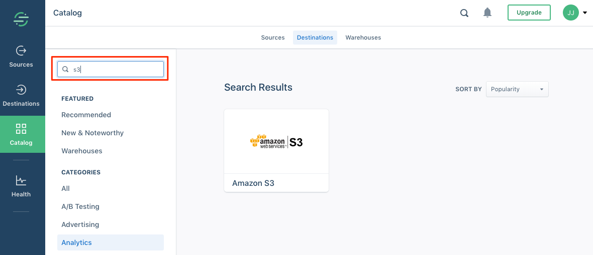

Click "Configure Amazon S3" to setup the S3 destination.


On the "Select Source" page, select an existing Source and click the "Confirm Source" button. To learn more about setting up Sources in Segment, see the Segment [documentation](https://segment.com/docs/sources/).

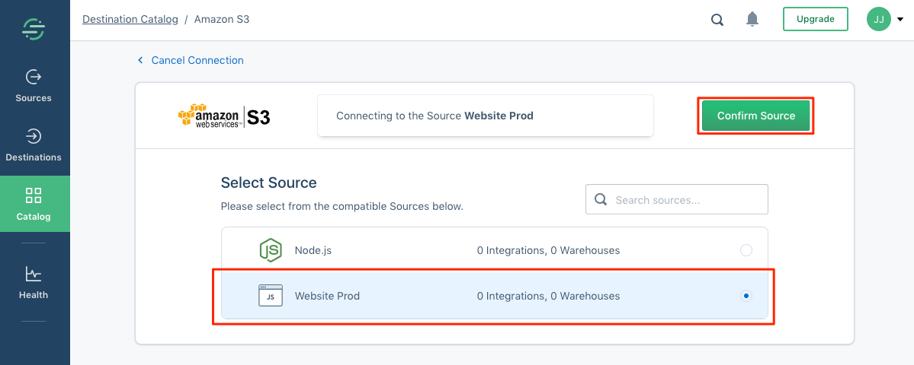

The Settings page for the S3 Destination requires an S3 bucket name. An S3 bucket has already been created for you in your AWS account for the workshop. To find the bucket name, login to your AWS workshop account and browse to the S3 service page in a different browser tab/window. Locate the bucket with a name starting with `personalize-data-...`. Click on the bucket name and copy the name to your clipboard.


Back on the Segment Amazon S3 destination settings page, paste the bucket name into the "Bucket Name" field. Also be sure to activate the destination at the top of the configuration form.

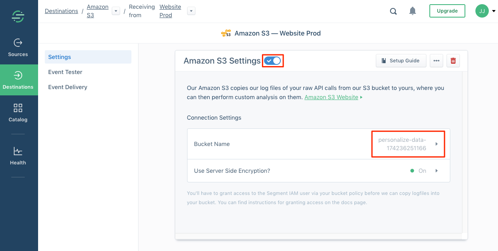

Detailed instructions for configuring an S3 destination can be found on Segment's [documentation site](https://segment.com/docs/destinations/amazon-s3/).

As mentioned above, we won't be testing actually pushing data through the S3 destination in this workshop due to time limitations. Instead, we will upload a dataset in the next part.

## Part 2 - Upload Raw Interaction Test Data to S3

Upload the sample raw dataset to the S3 bucket which has been created for you in the AWS-provided workshop account. The S3 bucket name will be in the format `personalize-data-ACCOUNT_ID` where ACCOUNT_ID is the ID for the AWS account that you're using for the workshop.

1. Log in to the AWS console. If you are participating in an AWS led workshop, use the instructions provided to access your temporary workshop account.
2. Browse to the S3 service.
3. Click on the bucket with a name like `personalize-data-...`.
4. Create a folder called `raw-events` in this bucket.
5. Click on the `raw-events` folder just created.
6. This repository already contains a compressed data file for you to upload. Upload the local file `data/raw-events/events.json.gz` in this repo to the `raw-events` folder in your S3 bucket.

> If you're stepping through this workshop in your own personal AWS account, you will need to create an S3 bucket yourself that has the [necessary bucket policy](https://docs.aws.amazon.com/personalize/latest/dg/data-prep-upload-s3.html) allowing Personalize access to your bucket. Alternatively, you can apply the CloudFormation template [eventengine/workshop.template](eventengine/workshop.template) within your account to have these resources created for you.

## Part 3 - Data Preparation

Since the raw format, fields, and event types in the Segment event data cannot be directly uploaded to Amazon Personalize for model training, this step will guide you through the process of transforming the data into the format expected by Personalize. We will start with raw event data that has already aggregated into a single JSON file which you uploaded to S3 in the previous step. We will use AWS Glue to create an ETL job that will take the JSON file, apply filtering and field mapping to each JSON event, and write the output back to S3 as a CSV file.

### Create AWS Glue ETL Job

First, ensure that you are logged in to the AWS account provided to you for this workshop. Then browse to the Glue service in the console, making sure that the AWS region is "N. Virginia" (us-east-1). Click the "Get started" button and then click "Jobs" in the left navigation on the Glue console page.

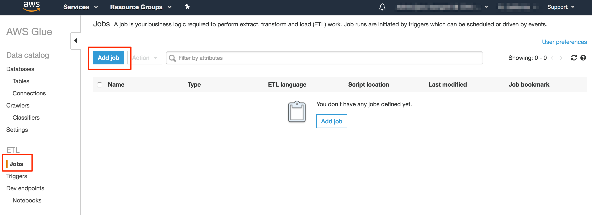

Click the "Add job" button and enter the following information.

* Enter a job name such as "SegmentEventsJsonToCsv".
* For IAM role, a role has already been created for you that starts with the name "module-personalize-GlueServiceRole-...". Select this role.
* Leave Type as "Spark".
* For "This job runs", click the radio button "A new script to be authored by you".
* Leave everything else the same and click Next at the bottom of the form.
* On the "Connections" step just click "Save job and edit script" since we are not accessing data in a database for this job.

The source code for the Glue job has already been written. Copy the contents of [etl/glue_etl.py](etl/glue_etl.py) to your clipboard and paste it into the Glue editor window. Click "Save" to save the job script.


Let's review key parts of the script in more detail. First, the script is initialized with a few job parameters. We'll see how to specify these parameter values when we run the job below. For now, just see we're passing in the location of the raw JSON files via `S3_JSON_INPUT_PATH` and the location where the output CSV should be written through `S3_CSV_OUTPUT_PATH`.

```python
args = getResolvedOptions(sys.argv, ['JOB_NAME', 'S3_JSON_INPUT_PATH', 'S3_CSV_OUTPUT_PATH'])
```

Next the Spark and Glue contexts are created and associated. A Glue Job is also created and initialized.

```python
sc = SparkContext()
glueContext = GlueContext(sc)
spark = glueContext.spark_session
job = Job(glueContext)
job.init(args['JOB_NAME'], args)
```

The first step in our Job is to load the raw JSON file as a Glue DynamicFrame.

```python
datasource0 = glueContext.create_dynamic_frame.from_options('s3', {'paths': [args['S3_JSON_INPUT_PATH']]}, 'json')
```

Since not all events that are written to S3 by Segment are relevant to training a Personalize model, we'll use Glue's `Filter` transformation to keep only the records we want. The `datasource0` DynamicFrame created above is passed to `Filter.apply(...)` function along with the `filter_function` function. It's in `filter_function` where we keep events that have a product SKU and `userId` specified. The resulting DynamicFrame is captured as `interactions`.

```python
def filter_function(dynamicRecord):
    if dynamicRecord["properties"]["sku"] and dynamicRecord["userId"]:
        return True
    else:
        return False

interactions = Filter.apply(frame = datasource0, f = filter_function, transformation_ctx = "interactions")
```

Next we will call Glue's `ApplyMapping` transformation, passing the `interactions` DynamicFrame from above and field mapping specification that indicates the fields we want to retain and their new names. These mapped field names will become the column names in our output CSV. You'll notice that we're using the product SKU as the `ITEM_ID` and `event` as the `EVENT_TYPE`. We're also renaming the `timestamp` field to `TIMESTAMP_ISO` since the format of this field value in the JSON file is an ISO 8601 date and Personalize requires timestamps to be specified in UNIX time (number seconds since Epoc).

```python
applymapping1 = ApplyMapping.apply(frame = interactions, mappings = [ \
    ("anonymousId", "string", "ANONYMOUS_ID", "string"), \
    ("userId", "string", "USER_ID", "string"), \
    ("properties.sku", "string", "ITEM_ID", "string"), \
    ("event", "string", "EVENT_TYPE", "string"), \
    ("timestamp", "string", "TIMESTAMP_ISO", "string")], \
    transformation_ctx = "applymapping1")
```

To convert the ISO 8601 date format to UNIX time for each record, we'll use Spark's `withColumn(...)` to create a new column called `TIMESTAMP` that is the converted value of the `TIMESTAMP_ISO` field. Before we can call `withColumn`, though, we need to convert the Glue DynamicFrame into a Spark DataFrame. That is accomplished by calling `toDF()` on the output of ApplyMapping transformation above. Since Personalize requires our uploaded CSV to be a single file, we'll call `repartition(1)` on the DataFrame to force all data to be written in a single partition. Finally, after creating the `TIMESTAMP` in the expected format, `DyanmicFrame.fromDF()` is called to convert the DataFrame back into a DyanmicFrame.

```python
# Repartition to a single file
onepartitionDF = applymapping1.toDF().repartition(1)
# Coalesce timestamp into unix timestamp
onepartitionDF = onepartitionDF.withColumn("TIMESTAMP", \
    unix_timestamp(onepartitionDF['TIMESTAMP_ISO'], "yyyy-MM-dd'T'HH:mm:ss.SSS'Z'"))
# Convert back to dynamic frame
onepartition = DynamicFrame.fromDF(onepartitionDF, glueContext, "onepartition_df")
```

The last step is to write our CSV back to S3 at the path specified by the `S3_CSV_OUTPUT_PATH` job property and commit the job.

```python
glueContext.write_dynamic_frame.from_options(frame = onepartition, connection_type = "s3", \
    connection_options = {"path": args['S3_CSV_OUTPUT_PATH']}, \
    format = "csv", transformation_ctx = "datasink2")

job.commit()
```

### Run AWS Glue ETL Job

With our ETL Job script created and saved, it's time to run the job to create the CSV needed to train a Personalize Solution. Before going any further, open another AWS console browser tab/window by right-clicking on the AWS logo in the upper left corner of the page and select "Open Link in New Tab" (or Window).

While still in the Glue service console and the job listed, click the "Run job" button. This will cause the Parameters panel to display. Click the "Security configuration, script libraries, and job parameters" section header to cause the job parameters fields to be displayed.

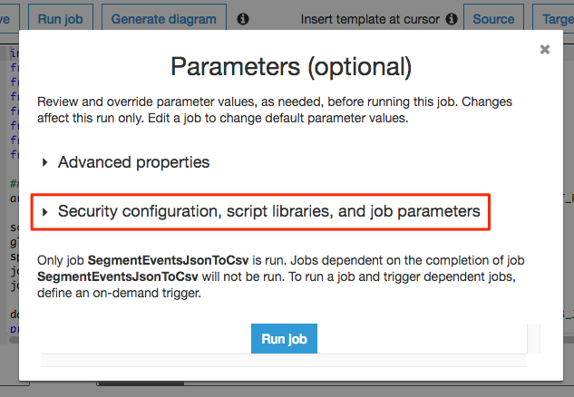

Scroll down to the "Job parameters" section. This is where we will specify the job parameters that our script expects for the path to the input data and the path to the output file. Create two job parameters with the following key and value. Be sure to prefix each key with `--` as shown. Substitute your account ID for `[ACCOUNT_ID]` in the values below. You copy the bucket name to your clipboard from the S3 service page in the tab/window you opened above. The order they are specified does not matter.

| Key                  | Value                                          |
| -------------------- | ---------------------------------------------- |
| --S3_JSON_INPUT_PATH | s3://personalize-data-[ACCOUNT_ID]/raw-events/ |
| --S3_CSV_OUTPUT_PATH | s3://personalize-data-[ACCOUNT_ID]/transformed |

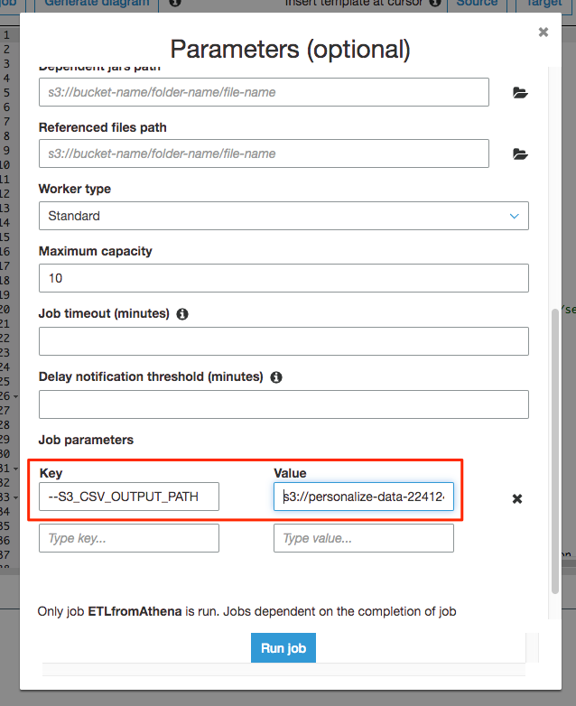

Click the "Run job" button to start the job. Once the job has started running you will see log output in the "Logs" tab at the bottom of the page. It may take a few minutes to complete.

When the job completes click the "X" in the upper right corner of the the page to exit the job script editor.

### Verify CSV Output File

Browse to the S3 service page in the AWS console and find the bucket with a name starting with `personalize-data-...`. Click on the bucket name. If the job completed successfully you should see a folder named "transformed". Click on "transformed" and you should see the output file created by the ETL job.


## Part 4 - Data Exploration

For the final part of the exercise we will learn how to create an AWS Glue Crawler to crawl and catalog the output of our ETL job in the AWS Glue Data Catalog. Once our file has been cataloged, we demonstrate how we can use Amazon Athena to run queries against the data file.

### Create Glue Crawler

Browse to AWS Glue in the AWS console. Ensure that you are still in the "N. Virginia" region. Click "Crawlers" in the left navigation.


Click the "Add crawler" button. For the "Crawler name" enter something like "SegmentEventsCrawler" and click "Next".

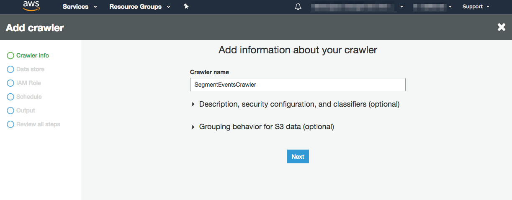

For the data store, select S3 and "Specified path in my account". For the "Include path", click the folder icon and select the "transformed" folder in the "personalize-data-..." bucket. Do __NOT__ select the "run-..." file. Click "Next" and then "Next" again when prompted to add another data store.

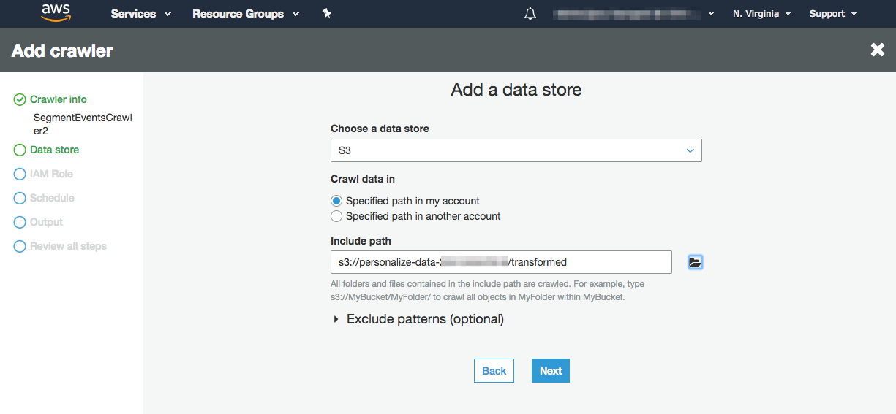

For the IAM role, select "Choose an existing IAM role" radio button and then select the "module-personalize-GlueServiceRole-..." role from the dropdown. Click "Next".

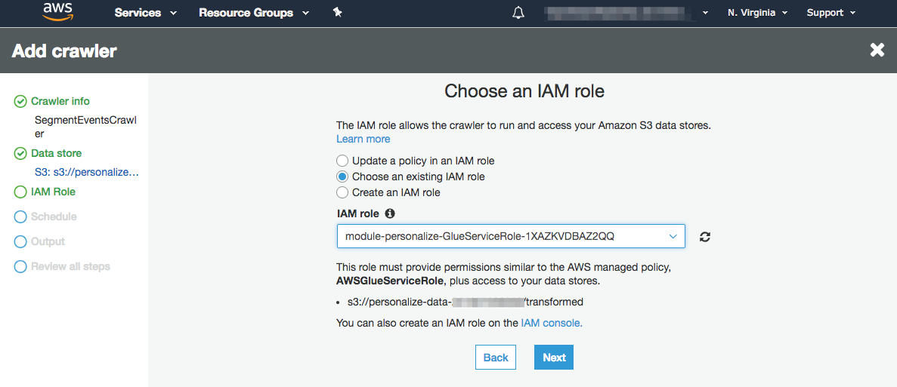

Leave the Frequency set to "Run on demand" and click "Next".

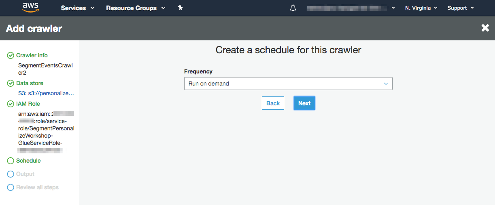

For the crawler output, click the "Add database" button and create a database named "segmentdata". Click "Next".

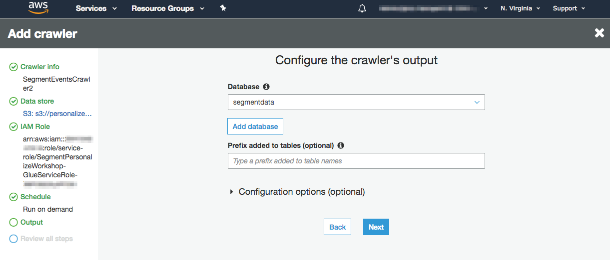

On the review page, click "Finish" at the bottom of the page.

From the Crawlers page, click the "Run it now?" link or select the checkbox for the crawler you just created and click "Run crawler".

Wait for the crawler to finish. It should take about 1-2 minutes. Once completed, the crawler will add a table named "segmentdata.transformed" to the Glue data catalog.

### Data Exploration

Now let's use Amazon Athena to query the transformed data just crawled.

Browse to Athena in the AWS console, ensuring that you are still in the N. Virginia region.

Make sure your database is selected in the left panel and you should see the "transformed" table below the database.


Enter the following SQL query in the "New query 1" tab.

```sql
SELECT * FROM "segmentdata"."transformed" limit 10;
```

Click the "Run query" button to execute this query against the CSV file.

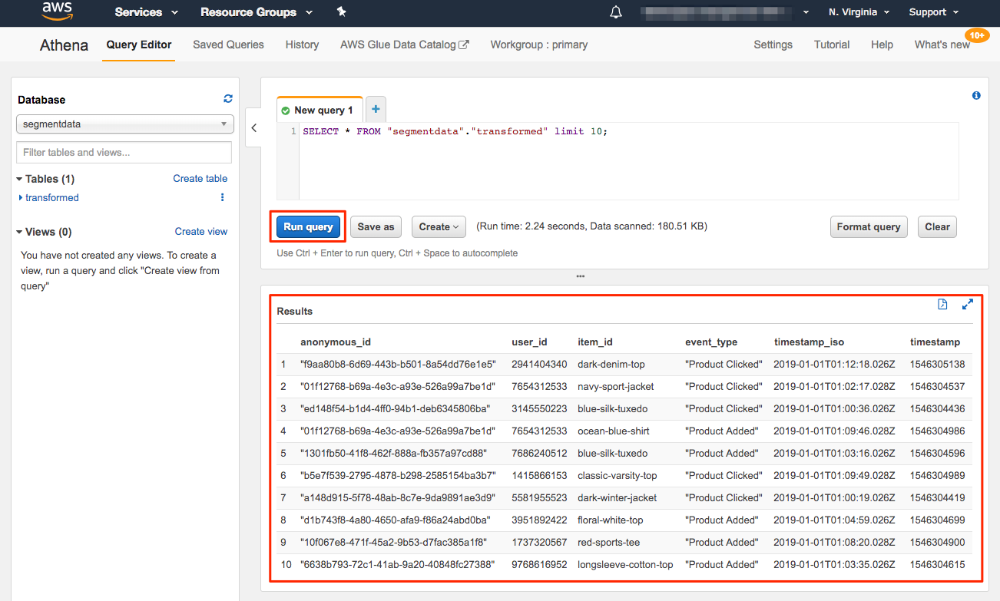

You will see the columns we specified in the "ApplyMapping" transformation in our Glue job as well as the "timestamp" column we added to represent the event time in UNIX timestamp format.

Experiment with additional queries on your own to get a better sense of how standard SQL can be used to explore your data on S3 using Athena. As you iterate on extracting and loading your datasets into Personalize, Athena can be a valuable tool to quickly investigate values in your datasets to understand and troubleshoot your data.

In the next [exercise](../exercise2/) we will create a Personalize Dataset Group and import the CSV as an interaction dataset.