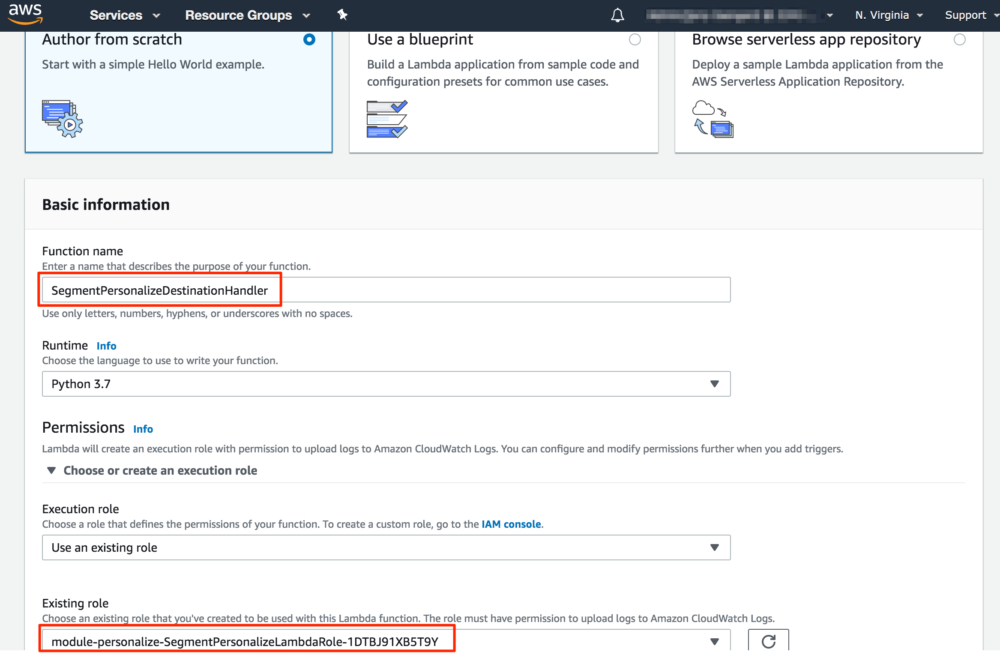
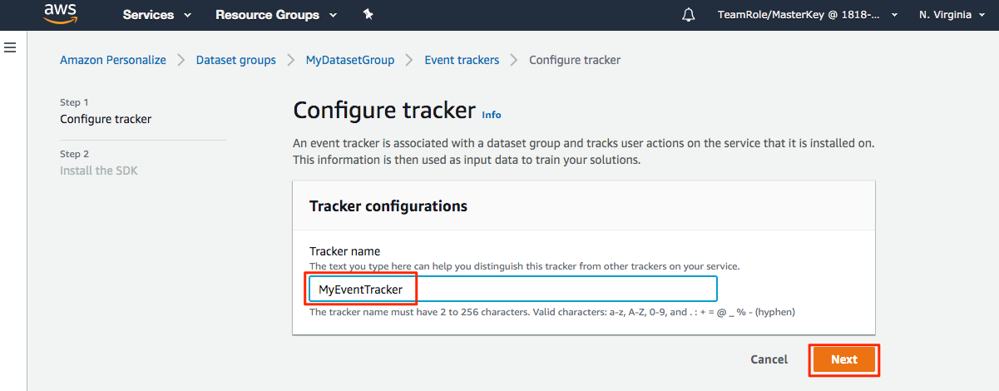
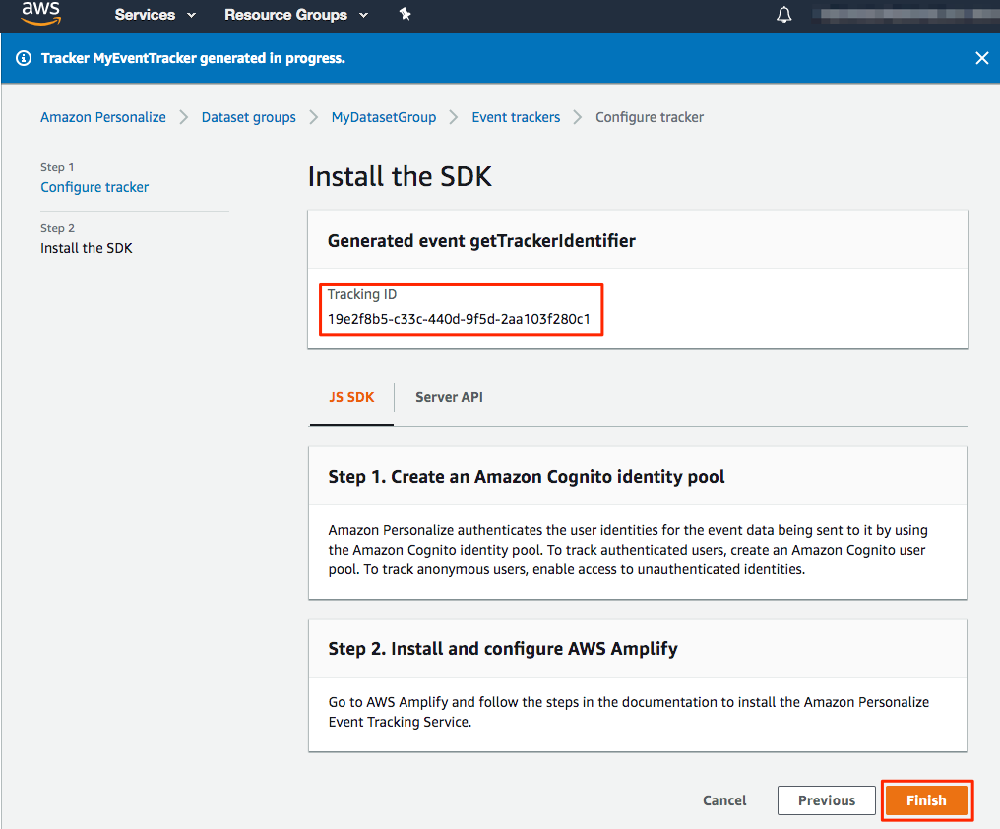
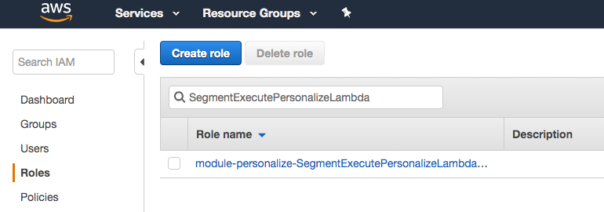
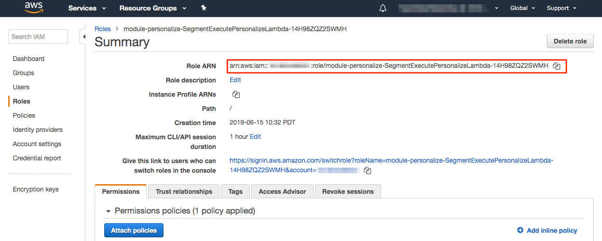

# Exercise 4 - Activating Recommendations using Segment Personas

## Overview

After you create a campaign using Amazon Personalize, you are able to get two different types of recommendations, dependent on what recipe type was used to train the model. For user-personalization and related-items recipes, the [GetRecommendations](https://docs.aws.amazon.com/personalize/latest/dg/API_RS_GetRecommendations.html) API returns a list of recommended items. For example, products or content can be recommended for users signed in to your website, or in marketing tools.

For search-personalization recipes, the [PersonalizeRanking](https://docs.aws.amazon.com/personalize/latest/dg/API_RS_PersonalizeRanking.html) API re-ranks a list of recommended items based on a specified query.

In [Exercise 3](https://github.com/james-jory/segment-personalize-workshop/blob/master/exercise3) you learned how to access your Personalize solution directly in applications, via a Lambda based API endpoint.

In this exercise, you will configure the Segment Personalize Destination, and then deploy a Lambda that can process your Segment events via that destination.  

This Lambda function will allow you to send updated events to keep your Personalize solution up to date on the latest user behavior being tracked via Segment.  You will also push updated product recommendations to your user profiles stored in Segment Personas when specific user events trigger a re-compute of recommendations.  

Once your recommendations are updated on a user profile, your marketing, analytics, and data teams can use these product recommendations in their campaign management and analytics tools with no additional work.  

## Exercise Preparation

If you haven't already cloned this repository to your local machine, do so now.

```
git clone https://github.com/james-jory/segment-personalize-workshop.git
```

## **Part 1 - Create an Event Processing Lambda Function**


First you will create a Lambda function that gets called by the Segment Personalize Destination. Each time Segment gets an event bound for this destination, your function will receive the event and will need to send a tracking event to your Personalize Tracker.  You will also get updated recommendations for the user that sent the event.


1. Navigate to Services > Lambda in your AWS Console.
2. In the left navigation pane (you can expose this with the hamburger button in the top left of the screen), select Functions.
3. Click ‘Create Function’ (see image below).


4. Select “Author from scratch” at the top of the screen.
5. Enter the name for your function: `SegmentPersonalizeDestinationHandler`. ***You must use this name for your function since the pre-made IAM policy for calling your function from Segment expects this name.***
6. Specify Python 3.7 as the runtime.
7. Under Permissions, click “Choose or create an execution role.”
8. Select “Use an existing role”.
9. Select the role that starts with the name `module-personalize-SegmentPersonalizeLambdaRole-...` in the "Existing role" dropdown.
10. Click ‘Create Function.’



11. Scroll down to the "Function code" panel.
12. Change the Handler text box to read `app.lambda_handler` instead of `lambda_function.lambda_handler` (if you don’t do this an error message will appear after the next step).
13. Select ‘Upload a .zip file’.


The source code for the function is provided in the workshop code home directory in `/exercise4/app.py`.  For this function, you will use a Lambda .zip file bundle that you will need to make the code work.  This is located in the workshop home directory in `/exercise4/function.zip`.

14. Click the Upload button.


15. Navigate to the directory where you cloned the git repo and go to `segment-personalize-workshop/exercise4/function.zip`


16. Click the Open button.
17. Click the Save button at the top of the screen.  It may take a few moments to complete this operation as your .zip file is uploaded.  

When completed, the function code should look something like this:


18. Next we need to register a Lambda Layer to wire up the Personalize API with the Python SDK.  This is only required until the Python Lambda runtime is update to include the  Personalize API.  You created the layer in the previous exercise.
19. Click on "Layers" below the function name in the Lambda Designer panel.
20. Then click the "Add a layer" button.


21. Select the Layer and the latest version and click the "Add" button.


Next, we need to add environment variables so the function can pass recommendation data back to Segment as well as a tracker for the Personalize Campaign to pass real-time data to Personalize.  Your Lambda code needs the Personalize Campaign ARN in order to ask for recommendations from the Personalize service.


22. To obtain the Personalize Campaign ARN, browse to the Personalize service landing page in the AWS console in a new tab or window.
23. Select the Dataset Group you created earlier and then Campaigns in the left navigation.
24. Click on the "segment-workshop-campaign" you created earlier.
25. Copy the Campaign ARN to your clipboard.
26. Don’t close this tab or window, you will need it in the next section.


27. Return to your Lambda function and scroll down to the "Environment variables" panel.  You may need to click on the function name in the Designer pane to expose the function environment variables.
28. Add an environment variable with the key `personalize_campaign_arn`.
29. Paste the Campaign ARN from your clipboard as the value.
30. Scroll to the top of the page and click the Save button to save your changes.


Another critical dependency in your function is the ability to call the Personalize [PutEvents API](https://docs.aws.amazon.com/personalize/latest/dg/API_UBS_PutEvents.html) endpoint so that new event data can be added to the training set for your Personalize solution.  This will enable the following Python code to work properly when sending events to Personalize:

```python
response = personalize_events.put_events(
      trackingId = os.environ['personalize_tracking_id'],
      userId = userId,
      sessionId = event['anonymousId'],
      eventList = [
          {
              "eventId": event['messageId'],
              "sentAt": int(dp.parse(event['timestamp']).strftime('%s')),
              "eventType": event['event'],
              "properties": json.dumps(properties)
          }
      ]
  )
```

The `trackingId` function argument in your Lambda code identifies the Personalize Event Tracker which should handle the events you submit. This value is passed to your Lambda function as another environment variable.


31. In the browser tab/window you opened earlier, browse to the Personalize service landing page in the AWS console.
32. Click on the Dataset Group and then "Event trackers" in the left navigation.
33. Click the "Create event tracker" button.


34. Enter a name for your Event Tracker.
35. Click the Next button.



The Event Tracker's tracking ID is displayed on the following page and is also available on the Event Tracker's detail page.

36. Copy this value to your clipboard and **be sure to press the "Finish" button**.



37. Return to your Lambda function.
38. Create a new key called `personalize_tracking_id`.
39. Paste the Event Tracker’s tracking ID into the value field.
40. **Click the Save button at the top of the page to save your changes.**


Your Lambda will also need a key for the Segment source that will ingest events you will send back via the Lambda, in order to update recommendations after user actions take place.


41. Go back to your Segment workspace tab or window.
42. Click on the `personas-event-source` source. This source will accept events from your Lambda function.
43. Copy the write key from the Overview tab to your clipboard.


44. Back again to your Lambda tab or window.
45. Create a new key called `connections_source_write_key`.
46. Paste the source key you just copied into the value field.
47. **Scroll to the top of the page and click the Save button to save your changes.**


Finally, you will need to add two more environment variables to your Lambda.  These are only required while Personalize is in Preview, and allow your Lambda to specify which region-specific API endpoints for Personalize your Lambda will use.


48. Add an environment variable called `endpoint_url`.
49. Set the value to  `https://personalize-runtime.us-east-1.amazonaws.com`.
50. Add an environment variable called `region_name`.
51. Set the value to  `us-east-1`.
52. Scroll to the top of the page and click the Save button to save your changes.
53. Check that your Lambda Environment variables look like the image below.


Your lambda is now ready to receive events from Segment!  In the next section, you will enable Segment to call your Lambda and send it events.

## Part 2 - Setting up Your Segment Destination

In this section you are going to connect your new Lambda event handler to Segment, via the Segment Personalize Destination.  This will enable events to flow to your Lambda and then to Personalize.


1. Go to your Segment workspace.
2. Click the Add Destination button in the top right of the Destinations list.


3. Type “amazon” into the search box in the screen that appears.
4. Select the Amazon Personalize destination.


5. On the screen that appears, click the Configure Amazon Personalize button.


6. Select the `website-prod` source and click the Confirm Source button.


To configure the destination, you will need to tell Segment the ARN of the Lambda you built in the first part of the exercise.  


7. Open the AWS management console in another tab or window.
8. Go to Services > Lambda > Functions.


9. Click on the link for the Lambda you built earlier.
10. At the top of the screen, you will see the ARN for your Lambda.
11. Copy the ARN to the clipboard.
12. Keep this window or tab open, you will need it in a moment.


13. Go back to your Segment workspace window.
14. Click on Connection Settings > Lambda.
15. Paste the ARN into the text box.
16. Click the Save button.


Segment will need execute permission to call your Lambda function from Segment's AWS account. An execution role has already been set up for you for the workshop.

17. Open the AWS management console in another tab or window.
18. Go to Services > IAM.
19. Click Roles.
20. In the Search box, type "SegmentExecutePersonalizeLambda".



21. Click on the role that appears.
22. At the top of the screen will be the role ARN for the role.
23. Copy the ARN to the clipboard.



24. Go back to your Segment workspace window.
25. Click Connection Settings > Role Address.
26. Paste the ARN into the text box.
27. Click the Save button.


You will also need to set the External ID that Segment will pass to IAM when invoking your Lambda.  This ID acts like a shared secret.  One has already been configured for you in the execution role.


28. Click on Other Settings > External ID.
29. Type in `123456789` into the text box.
30. Click the Save button.


Segment’s destination tries to find your Lambda in the us-west-2 AWS region by default.  Because your Lambda was configured in us-east-1, you will need to change this setting.


31. Click on Other Settings > Region.
32. Type in `us-east-1` in the text box.
33. Click the Save button.


Because you will be running in debug mode in a few steps, we will enable debug logging in the Lambda here.


34. Click on Other Settings > Log Type.
35. Select “Tail”.
36. Click the “Save” button.


37. Finally, you can turn on the Personalize destination by clicking the slider toggle at the top of the screen.


Your destination is now ready to process events.  In the next section, you will send a batch of events through your Lambda to show how you can process real-time events.  First, let’s make sure that your Lambda is ready to process events, by sending a test event via the Segment Event Tester.


38. Click “Event Tester” in the left hand pane of your Amazon Personalize Settings screen.


39. Paste the following JSON into the Event Tester.
40. Make sure the JSON tab is selected at the top, you do not need to select an event type.

```
{
      "messageId": "test-message-33dlvn",
      "timestamp": "2019-02-25T15:55:05.905Z",
      "type": "track",
      "email": "test@example.org",
      "properties": {
        "sku": "ocean-blue-shirt"
      },
      "userId": "2941404340",
      "anonymousId": "2941404340-anon",
      "event": "Product Clicked"
}
```

If all goes well, you will see a screen that look like this:


In some cases, you may get timeout errors from this screen.  This is generally caused by the Lambda being deployed slowly.  Re-try sending the event.

This is also where you may see a permissions error - this most likely means that you entered an incorrect external id, an incorrect IAM role ID, or your Lambda function is not named `SegmentPersonalizeDestinationHandler`.  Check those, and try sending a test event again.


41. In your Segment workspace, click on Sources > personas-event-source.
42. Select the Debugger tab.
43. Your Lambda should have sent an event with product recommendations into your source:


## **Part 3 - Activating Recommendations using Customer Profile Traits**

For this final step, you will test your new recommendations endpoint and its synchronization with your user profiles inside of Personas.

In Exercise 1, you ran a Python script to populate data into your Segment instance.   You are going to run it again in this section, so that you can see how the whole event pipeline works.  


1. Open your terminal window, or go to your Cloud9 terminal in your browser.
2. `cd` to the workshop repo directory `segment-personalize-workshop/data`
3. Run the Python Script in your terminal:

```
python segment-event-generator.py 2019-05-19
```

4. Go to your Segment workspace.
5. Click on the `website-prod` source.
6. Select the Debugger tab at the top of the screen.


As events are sent to the source by the Python script, you will see them appear in real-time in the Debugger view.  Segment is now forwarding events to the Personalize source you just built.

As events start to flow through Segment, you should start to see a list of recommended products from your Personalize solution appearing as traits on user Profiles in Personas.


7. To see user traits, go to your Segment workspace
8. Click the Personas Orb > Explorer tab
9. Click on a user profile as shown below
10. Under the user’s Custom traits tab you will see a `recommended_products` trait, which is kept updated by your Lambda!


By enabling additional destinations in Segment Personas, you can now pass these traits along with the user’s profile to an email tool, data warehouses, downstream event destinations, or to paid campaign tools like Facebook Custom Audiences.
